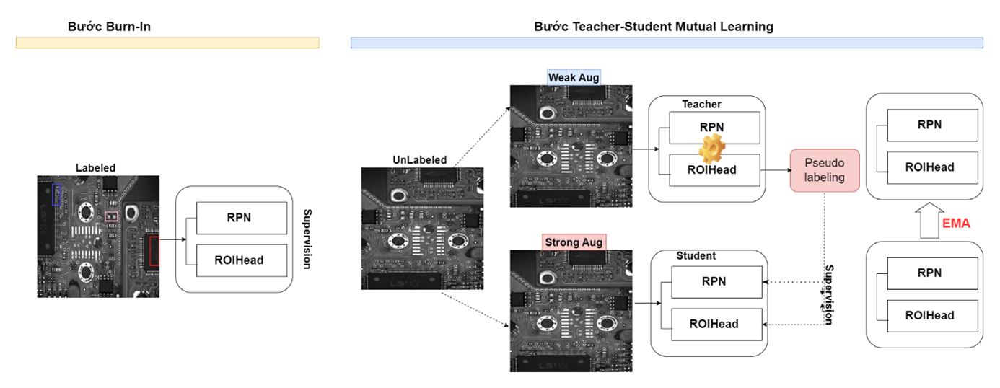

# Unbiased Teacher for Semi-Supervised Object Detection

<p align="center">

</p>

# Installation

## Prerequisites

- Linux or macOS with Python ≥ 3.6
- PyTorch ≥ 1.5 and torchvision that matches the PyTorch installation.

## Install PyTorch in Conda env

```shell
# create conda env
conda create -n detectron2 python=3.6
# activate the enviorment
conda activate detectron2
# install PyTorch >=1.5 with GPU
conda install pytorch torchvision -c pytorch
```

## Build Detectron2 from Source

Follow the [INSTALL.md](https://github.com/facebookresearch/detectron2/blob/master/INSTALL.md) to install Detectron2.

## Dataset

Organize the dataset as following:

```shell
unbiased_teacher/
└── datasets/
    └── coco/
        ├── train2017/
        ├── val2017/
        └── annotations/
        	├── instances_train2017.json
        	└── instances_val2017.json
```

## Training

- Chúng tôi sử dụng google colab pro với cấu hình (GPU T4 Tesla, VRAM 16GB)

- Huấn luyện Unbiased với 20% dữ liệu của chúng tôi (ResNet-50)

```shell
python train_net.py \
      --num-gpus 1 \
      --config configs/coco_supervision/faster_rcnn_R_50_FPN_sup1_run1_custom.yaml \
```

- Train the Unbiased Teacher under 2% COCO-supervision

## Resume the training

```shell
python train_net.py \
      --resume \
      --num-gpus 1 \
      --config configs/coco_supervision/faster_rcnn_R_50_FPN_sup10_run1_custom.yaml \
      MODEL.WEIGHTS <your weight>.pth
```

## Inference

- Register dataset

```shell
from detectron2.data.datasets import register_coco_instances

register_coco_instances("YOUR_TRAIN_DATASET", {}, "***PATH TO ANNOTATION JSON FILE***", "***PATH TO IMG FOLDER***")
register_coco_instances("YOUR_TEST_DATASET", {}, "***PATH TO ANNOTATION JSON FILE***", "***PATH TO IMG FOLDER***")
```

- config model

```shell
from detectron2.config import get_cfg

cfg = get_cfg()

cfg.merge_from_file("./configs/Base-RCNN-FPN.yaml")
cfg.MODEL.WEIGHTS = os.path.join("./output/model_best.pth")
cfg.MODEL.ROI_HEADS.NUM_CLASSES = 1
cfg.MODEL.ROI_HEADS.SCORE_THRESH_TEST = 0.50   # Testing threshold
cfg.DATASETS.TRAIN = ("YOUR_TRAIN_DATASET", )
cfg.DATASETS.TEST = ("YOUR_TEST_DATASET", )
```

- Predict image

```shell
from detectron2.data import DatasetCatalog
import cv2, random
from google.colab.patches import cv2_imshow
from detectron2.utils.visualizer import Visualizer
from ubteacher.engine.trainer import CustomPredictor

dataset_dicts = DatasetCatalog.get("YOUR_TEST_DATASET")
predictor = CustomPredictor(cfg)

for d in random.sample(dataset_dicts, 2):
    im = cv2.imread(d["file_name"])
    outputs = predictor(im)
    v = Visualizer(im[:, :, ::-1],
                   scale=1
    )
    out = v.draw_instance_predictions(outputs["instances"].to("cpu"))
    cv2_imshow(out.get_image()[:, :, ::-1])
```

```BibTeX
@inproceedings{liu2021unbiased,
    title={Unbiased Teacher for Semi-Supervised Object Detection},
    author={Liu, Yen-Cheng and Ma, Chih-Yao and He, Zijian and Kuo, Chia-Wen and Chen, Kan and Zhang, Peizhao and Wu, Bichen and Kira, Zsolt and Vajda, Peter},
    booktitle={Proceedings of the International Conference on Learning Representations (ICLR)},
    year={2021},
}
```

Also, if you use Detectron2 in your research, please use the following BibTeX entry.

```BibTeX
@misc{wu2019detectron2,
  author =       {Yuxin Wu and Alexander Kirillov and Francisco Massa and
                  Wan-Yen Lo and Ross Girshick},
  title =        {Detectron2},
  howpublished = {\url{https://github.com/facebookresearch/detectron2}},
  year =         {2019}
}
```

## License

This project is licensed under [MIT License](LICENSE), as found in the LICENSE file.
